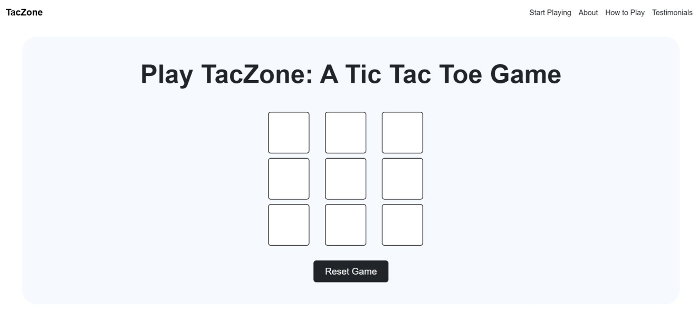

# TacZone

**TacZOne** is a clean, fun, and interactive web-based Tic Tac Toe game. Built with HTML, CSS and JavaScript.

## 🎮 Demo Screenshot



## 🔗 Live Demo

Play the game live here: **[TacZone](https://premkrrajbhar.github.io/TacZone/)**

## 📋 Features

- **Player Turns**: Alternates between Player X and Player O on each click.
- **Winner Detection**: Automatically detects when a player has won by completing a row, column, or diagonal.
- **Draw Detection**: If all boxes are filled without a winner, the game declares a draw.
- **Reset Functionality**: The game can be reset using a button to start a new round.
- **Responsive Design**: Optimized for desktops, tablets, and mobile devices, ensuring a smooth experience on any screen size.
- **User-Friendly Interface**: Simple and intuitive UI with clear buttons and grid layout, perfect for quick and easy gameplay.

## 🛠️ Technologies Used

- **HTML**: Provides the structure and layout of the game board.
- **CSS**: for custom styling.
- **Bootstrap**: for styling and responsive layout 
- **JavaScript**: Implements the game logic, including turn tracking, winner detection, draw check, and game reset.

## 💻 How to Play

- **Start the Game**: Open the `index.html` file in your browser to begin.
- **Make a Move**: Click on an empty square to make a move. Player X goes first.
- **Win or Draw**: The game will automatically detect if a player wins or if the game ends in a draw.
- **Reset the Game**: Click the **"Reset Game"** button to start a new round with an empty board.
- **Game Result**: Once the game ends, you will show a message of Result

## 📂 Project Structure

```
├── LICENSE
├── README.md
├── assets
│   ├── favicon
│   │   └── taczoneFavicon.png
│   ├── images
│   │   ├── about-section
│   │   │   └── img.png
│   │   ├── how-to-play-section
│   │   │   └── img.png
│   │   └── testimonial-section
│   │       ├── img.png
│   │       └── users
│   │           ├── user-1.jpg
│   │           ├── user-2.jpg
│   │           └── user-3.jpg
│   └── screenshot
│       └── screenshot.jpg
├── css
│   └── style.css
├── index.html
└── script
    └── script.js


```

## 📝 How to Run Locally

- Step 1: Clone the repository:

   ```bash
   git clone https://github.com/premkrrajbhar/TacZone.git
   ```

- Step 2: Navigate to the project folder:

   ```bash
   cd TacZone
   ```

- Step 3:  Open the `index.html` file in your web browser to start the game.

## 📄 License
This project is open-source and free to use under the MIT License.

## 🤝 Contributing

Contributions are welcome! Feel free to submit a pull request or open an issue for any suggestions or improvements.

## 📞 Contact

For any questions or feedback, please reach out to:

- **Email**: [premkumarrajbhar22@gmail.com](mailto:premkumarrajbhar22@gmail.com)
- **GitHub**: [premkrrajbhar](https://github.com/premkrrajbhar)
